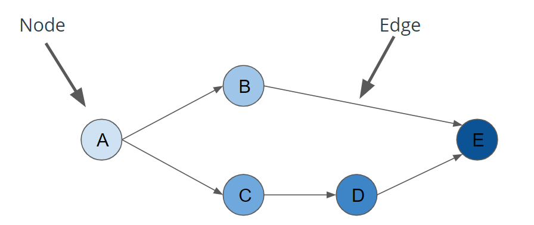
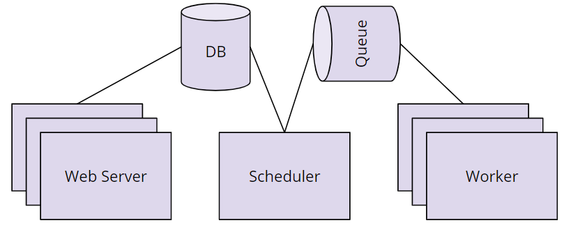
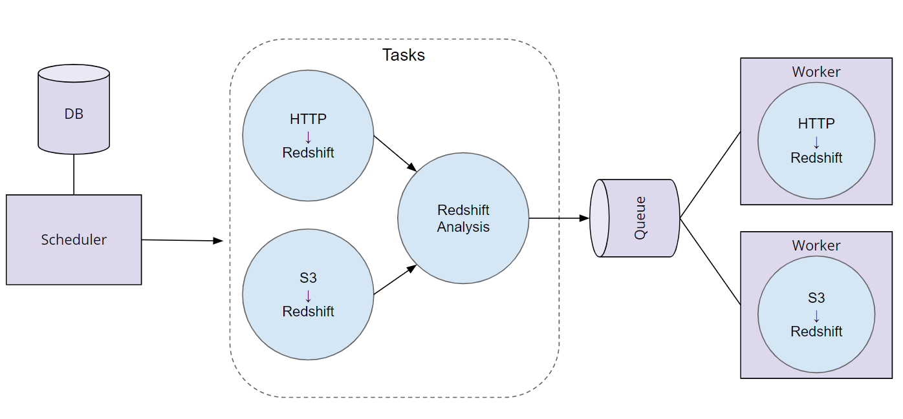
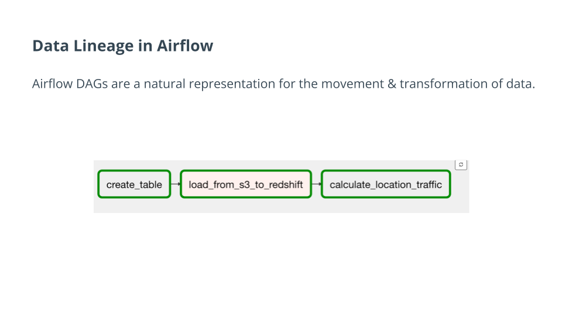
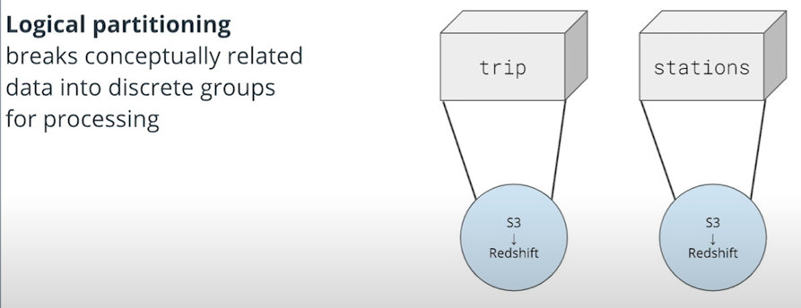
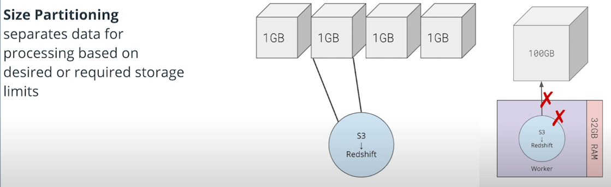
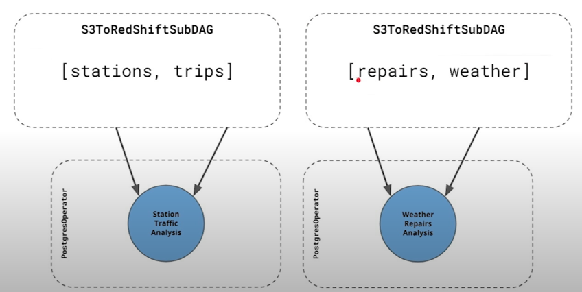

# Automate Data Pipelines with Apache Airflow

<!-- TOC -->
* [Automate Data Pipelines with Apache Airflow](#automate-data-pipelines-with-apache-airflow)
  * [1. Introduction to Automating Data Pipelines](#1-introduction-to-automating-data-pipelines)
    * [What is a Data Pipeline?](#what-is-a-data-pipeline)
    * [Extract Transform Load (ETL) and Extract Load Transform (ELT):](#extract-transform-load--etl--and-extract-load-transform--elt--)
    * [What is Kafka?](#what-is-kafka)
    * [What is RedShift?](#what-is-redshift)
  * [2. Data Pipelines](#2-data-pipelines)
    * [2.1. Lesson Overview](#21-lesson-overview)
    * [2.2. DAGs and Data Pipelines](#22-dags-and-data-pipelines)
    * [2.3. How Airflow Works](#23-how-airflow-works)
    * [2.4. Context and Templating](#24-context-and-templating)
  * [3. Data Quality](#3-data-quality)
    * [3.1. Data Lineage](#31-data-lineage)
    * [3.2. Updating DAGs](#32-updating-dags)
    * [3.2. Data Partitioning](#32-data-partitioning)
    * [3.3. Data Quality Requirements](#33-data-quality-requirements)
  * [4. Production Data Pipelines](#4-production-data-pipelines)
    * [4.1. Lesson Overview](#41-lesson-overview)
    * [4.2. Airflow Plugins](#42-airflow-plugins)
    * [4.3. Airflow Contrib](#43-airflow-contrib)
    * [4.4. Task Boundaries](#44-task-boundaries)
    * [4.5. SubDAGs](#45-subdags)
    * [4.5. Monitoring](#45-monitoring)
    * [4.6. Other Pipeline Orchestrators](#46-other-pipeline-orchestrators)
<!-- TOC -->

## 1. Introduction to Automating Data Pipelines

### What is a Data Pipeline?
A data pipeline describes, in code, a series of sequential data processing steps. Depending on the data requirements for each step, some steps may occur in parallel.
Data pipelines also typically occur on a schedule. Extract, transform and load (ETL), or extract, load, and transform (ELT), are common patterns found in data pipelines, but not strictly required. Some data pipelines perform only a subset of ETL or ELT.

Examples of data pipelines:

* Personalized emails that are triggered after a data pipeline executed.
* Companies commonly use data pipelines to orchestrate the analysis that determines pricing. For example, a rideshare app where you were offered real-time pricing.
* a Bikeshare company, that wants to figure out where their busiest locations are. They might use this data to determine where to build additional locations, or simply to add more bikes. A data pipeline to accomplish this task would likely first load application event data from a source such as S3 or kafka. Second, we might take that data and then load it into an analytic warehouse such as RedShift. Then third, perform data transformations that identify high-traffic bike docks.

### Extract Transform Load (ETL) and Extract Load Transform (ELT):

"ETL is normally a continuous, ongoing process with a well-defined workflow. ETL first extracts data from homogeneous or heterogeneous data sources.
Then, data is cleansed, enriched, transformed, and stored either back in the lake or in a data warehouse.

"ELT (Extract, Load, Transform) is a variant of ETL wherein the extracted data is first loaded into the target system.
Transformations are performed after the data is loaded into the data warehouse. ELT typically works well when the target system is powerful enough to handle transformations.
Analytical databases like Amazon Redshift and Google BigQuery." Source: Xplenty.com

### What is Kafka?
"Apache Kafka is an open-source stream-processing software platform developed by Linkedin and donated to the Apache Software Foundation, written in Scala and Java. The project aims to provide a unified, high-throughput, low-latency platform for handling real-time data feeds. Its storage layer is essentially a massively scalable pub/sub message queue designed as a distributed transaction log, making it highly valuable for enterprise infrastructures to process streaming data." Source: Wikipedia.

If you want to learn more, start [here](https://kafka.apache.org/intro).

### What is RedShift?
"Amazon Redshift is a fully managed, petabyte-scale data warehouse service in the cloud.
You can start with just a few hundred gigabytes of data and scale to a petabyte or more...
The first step to create a data warehouse is to launch a set of nodes, called an Amazon Redshift cluster.
After you provision your cluster, you can upload your data set and then perform data analysis queries.
Regardless of the size of the data set, Amazon Redshift offers fast query performance using the same SQL-based tools and business intelligence applications that you use today.

If you want to learn more, start [here](https://docs.aws.amazon.com/redshift/latest/mgmt/welcome.html).

So in other words, S3 is an example of the final data store where data might be loaded (e.g. ETL). While Redshift is an example of a data warehouse product, provided specifically by Amazon.

## 2. Data Pipelines

### 2.1. Lesson Overview

In this lesson, you'll learn more about data pipelines and how they can be represented as Directed Acyclic Graphs (DAGs). We'll also cover:

* Data validation
* How Apache Airflow uses DAGs
* How Airflow works
* Schedules in Airflow
* Operators and Tasks in Airflow
* Connections and Hooks in Airflow
* Context and Templating in Airflow
* We'll end the lesson by building an AWS S3 to Redshift DAG

### 2.2. DAGs and Data Pipelines

Definitions
* `Directed Acyclic Graphs (DAGs)`: DAGs are a special subset of graphs in which the edges between nodes have a specific direction, and no cycles exist. When we say “no cycles exist” what we mean is the nodes can't create a path back to themselves.
* `Nodes`: A step in the data pipeline process.
* `Edges`: The dependencies or relationships other between nodes.

### 2.3. How Airflow Works

 Airflow Components

* __Scheduler__ orchestrates the execution of jobs on a trigger or schedule. The Scheduler chooses how to prioritize the running and execution of tasks within the system. You can learn more about the Scheduler from the official [Apache Airflow documentation](https://airflow.apache.org/scheduler.html).

* __Work Queue__ is used by the scheduler in most Airflow installations to deliver tasks that need to be run to the __Workers__.

* __Worker__ processes execute the operations defined in each DAG. In most Airflow installations, workers pull from the __work queue__ when it is ready to process a task. When the worker completes the execution of the task, it will attempt to process more work from the __work queue__ until there is no further work remaining. When work in the queue arrives, the worker will begin to process it.

* __Database__ saves credentials, connections, history, and configuration. The database, often referred to as the metadata database, also stores the state of all tasks in the system. Airflow components interact with the database with the Python ORM, [SQLAlchemy](https://www.sqlalchemy.org/).

* __Web Interface__ provides a control dashboard for users and maintainers. Throughout this course you will see how the web interface allows users to perform tasks such as stopping and starting DAGs, retrying failed tasks, configuring credentials, The web interface is built using the [Flask web-development microframework](http://flask.pocoo.org/).

 

 How Airflow Works

Order of Operations For an Airflow DAG
1. The Airflow Scheduler starts DAGs based on time or external triggers.
2. Once a DAG is started, the Scheduler looks at the steps within the DAG and determines which steps can run by looking at their dependencies.
3. The Scheduler places runnable steps in the queue.
4. Workers pick up those tasks and run them.
5. Once the worker has finished running the step, the final status of the task is recorded and additional tasks are placed by the scheduler until all tasks are complete.
6. Once all tasks have been completed, the DAG is complete.

### 2.4. Context and Templating

[Here](https://airflow.apache.org/docs/apache-airflow/stable/macros-ref.html) is the Apache Airflow documentation on context variables that can be included as kwargs.

Here is a link to a [blog post](https://blog.godatadriven.com/zen-of-python-and-apache-airflow) that also discusses this topic.

You need to set `provide_context=True` in operators to get the context. Please check [Exercise 5: Context & Templating](exercises#exercise-5---context--templating) for more details.

## 3. Data Quality

### 3.1. Data Lineage

Data lineage uncovers the life cycle of data. It aims to show the complete data flow, from start to finish.
Data lineage is the process of understanding, recording, and visualizing data as it flows from data sources to consumption.
This includes all transformations the data underwent along the way. How the data was transformed, what changed, and why.

The data lineage of a dataset describes the discrete steps involved in the creation, movement, and calculation of that data.

Airflow keeps a record of historical DAG and task executions, but it does not store the code from those historical runs.
Whatever the latest code is in your DAG definition is what Airflow will render for you in the browser.

### 3.2. Updating DAGs

Best practice is versioning the DAGs for changes:
* To keep the history & logs consistent and comparable
* To keep the track of changes

You can stop previous DAGs and enable new DAGs

The methodology is a kind of team decision.

### 3.2. Data Partitioning

Pipeline data partitioning is the process of isolating data to be analyzed by one or more attributes, such as time, logical type, or data size.

__Why Data Partitioning?__

Pipelines designed to work with partitioned data fail more gracefully.
Smaller datasets, smaller time periods, and related concepts are easier to debug than big datasets, large time periods, and unrelated concepts.
Partitioning makes debugging and rerunning failed tasks much simpler. It also enables easier redos of work, reducing cost and time.

Another great thing about Airflow is that if your data is partitioned appropriately, your tasks will naturally have fewer dependencies on each other.
Because of this, Airflow will be able to parallelize execution of your DAGs and tasks to produce your results even faster.

Data partitioning often leads to faster and more reliable pipelines.

These are the common types of partitioning:

* __Logical partitioning__
  * Conceptually related data can be partitioned into discrete segments and processed separately. This process of separating data based on its conceptual relationship is called logical partitioning. With logical partitioning, unrelated things belong in separate steps. Consider your dependencies and separate processing around those boundaries.
  * Also, worth mentioning, the data location is another form of logical partitioning. For example, if our data is stored in a key-value store like Amazon's S3 in a format such as: `s3://<bucket>/<year>/<month>/<day>` we could say that our date is logically partitioned by time.

* __Size partitioning or data size partitioning__
  * Size partitioning separates data for processing based on desired or required storage limits. This essentially sets the amount of data included in a data pipeline run. Size partitioning is critical to understand when working with large datasets, especially with Airflow.

* __Schedule partitioning__
  * Not only are schedules great for reducing the amount of data our pipelines have to process, but they also help us guarantee that we can meet timing guarantees that our data consumers may need.
  * Please check the [Exercise 3 - Data Partitioning](exercises#exercise-3---data-partitioning)
* You could also partition around events

### 3.3. Data Quality Requirements

Adherence to a set of requirements is a good starting point for measuring data quality.

Requirements should be defined by you and your data consumers before you start creating your data pipeline.

Examples of Requirements:
* Data must be a certain size
* Data must be accurate to some margin of error
* Data must arrive within a given timeframe from the start of execution
* Pipelines must run on a particular schedule
* Data must not contain any sensitive information

## 4. Production Data Pipelines
### 4.1. Lesson Overview

In this lesson, we'll be learning about how to build maintainable and reusable pipelines in Airflow.

* Focus on elevating your DAGs to reliable, production-quality data pipelines.
* Extending airflow with custom plug-ins to create your own hooks and operators.
* How to design task boundaries so that we maximize visibility into our tasks.
* subDAGs and how we can actually reuse DAGs themselves.
* Monitoring in Airflow

### 4.2. Airflow Plugins

Airflow was built with the intention of allowing its users to extend and customize its functionality through plugins.
The most common types of user-created plugins for Airflow are Operators and Hooks.
These plugins make DAGs reusable and simpler to maintain.

To create custom operator, follow the steps:

* Identify Operators that perform similar functions and can be consolidated
* Define a new Operator in the plugins folder
* Replace the original Operators with your new custom one, re-parameterize, and instantiate them.

### 4.3. Airflow Contrib

Airflow has a rich and vibrant open source community.
This community is constantly adding new functionality and extending the capabilities of Airflow.
As an Airflow user, you should always check [Airflow contrib](https://github.com/apache/airflow/tree/master/airflow/contrib) before building your own airflow plugins, to see if what you need already exists.

Operators and hooks for common data tools like Apache Spark and Cassandra, as well as vendor specific integrations for Amazon Web Services, Azure, and Google Cloud Platform can be found in Airflow contrib.
If the functionality exists and its not quite what you want, that’s a great opportunity to add that functionality through an open source contribution.

__Note__: Airflow contrib folder is depreciated, but the list of packages are still exist.

### 4.4. Task Boundaries

DAG tasks should be designed such that they are:

* Atomic and have a single purpose
* Maximize parallelism
* Make failure states obvious
* Every task in your dag should perform __only one job__.

“Write programs that do one thing and do it well.” - Ken Thompson’s Unix Philosophy

__Benefits of Task Boundaries__:

* Re-visitable: Task boundaries are useful for you if you revisit a pipeline you wrote after a 6 month absence. You'll have a much easier time understanding how it works and the lineage of the data if the boundaries between tasks are clear and well defined. This is true in the code itself, and within the Airflow UI.
* Tasks that do just one thing are often more easily parallelized. This parallelization can offer a significant speedup in the execution of our DAGs.

### 4.5. SubDAGs
Commonly repeated series of tasks within DAGs can be captured as reusable SubDAGs. Benefits include:

* Decrease the amount of code we need to write and maintain to create a new DAG
* Easier to understand the high level goals of a DAG
* Bug fixes, speedups, and other enhancements can be made more quickly and distributed to all DAGs that use that SubDAG

__Drawbacks of Using SubDAGs__

* Limit the visibility within the Airflow UI
* Abstraction makes understanding what the DAG is doing more difficult
* Encourages premature optimization
  * "Attempts at efficiency (can) have a strong negative impact when debugging and maintenance are considered." - Donald Knuth

__Can Airflow nest subDAGs?__

Yes, you can nest subDAGs. However, you should have a really good reason to do so because it makes it much harder to understand what's going on in the code. Generally, subDAGs are not necessary at all, let alone subDAGs within subDAGs.

### 4.5. Monitoring

Airflow can surface metrics and emails to help you stay on top of pipeline issues.

__SLAs__

Airflow DAGs may optionally specify an SLA, or “Service Level Agreement”, which is defined as __a time by which a DAG must complete.__
For time-sensitive applications these features are critical for developing trust amongst your pipeline customers and ensuring that data is delivered while it is still meaningful.
Slipping SLAs can also be __early indicators of performance problems__, or a need to scale up the size of your Airflow cluster

__Emails and Alerts__

Airflow can be configured to send emails on DAG and task state changes.
These state changes may include successes, failures, or retries.
Failure emails can allow you to easily trigger alerts. It is common for alerting systems like PagerDuty to accept emails as a source of alerts.
If a mission-critical data pipeline fails, you will need to know as soon as possible to get online and get it fixed.

__Metrics__

Airflow comes out of the box with the ability to send system metrics using a metrics aggregator called statsd.
Statsd can be coupled with metrics visualization tools like [Grafana](https://grafana.com/) to provide you and your team high level insights into the overall performance of your DAGs, jobs, and tasks.
These systems can be integrated into your alerting system, such as pagerduty, so that you can ensure problems are dealt with immediately. These Airflow system-level metrics allow you and your team to stay ahead of issues before they even occur by watching long-term trends.

### 4.6. Other Pipeline Orchestrators

Here are some resources to explore other data pipeline orchestrators.

1. This [Github link](https://github.com/pditommaso/awesome-pipeline) contains perhaps way too many examples, but it shows a nice list of other pipeline orchestrators.
2. You can also check out these pages to see how Airflow's components can be generalized to the elements of other pipeline orchestrators.

* [Quora page](https://www.quora.com/Which-is-a-better-data-pipeline-scheduling-platform-Airflow-or-Luigi)
* [Medium post](https://medium.com/@cyrusv/luigi-vs-airflow-vs-zope-wfmc-comparison-of-open-source-workflow-engines-de5209e6dac1)

