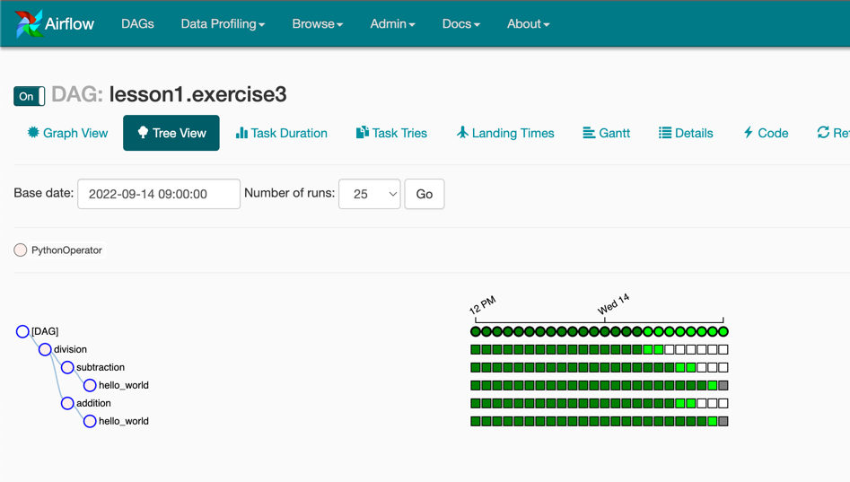
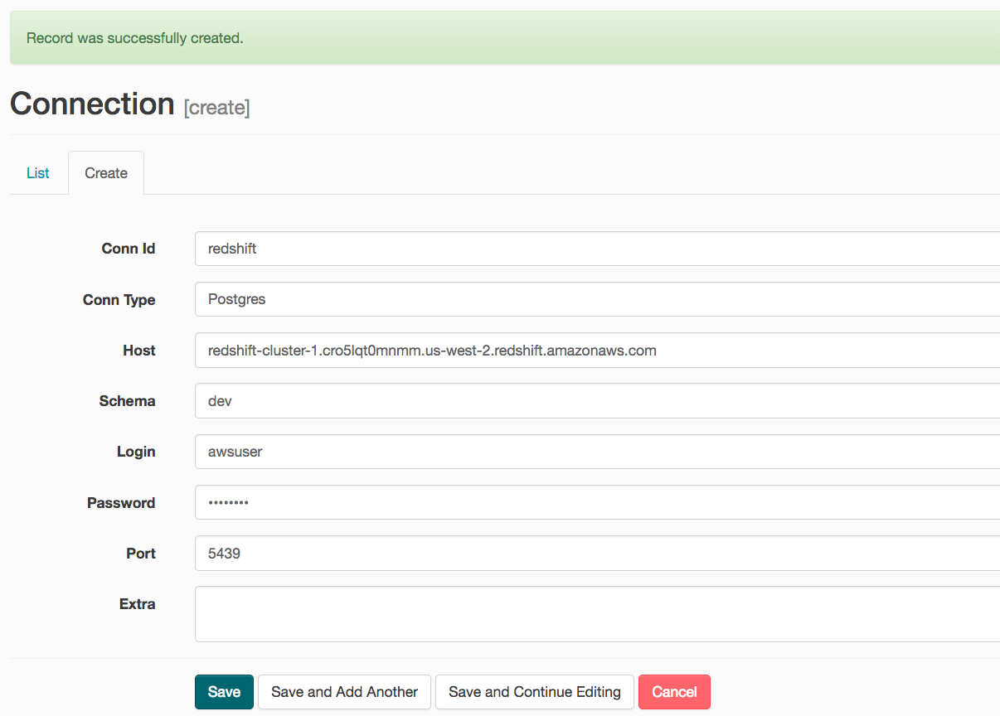
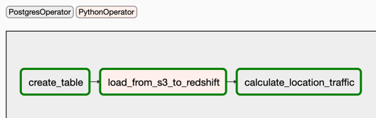
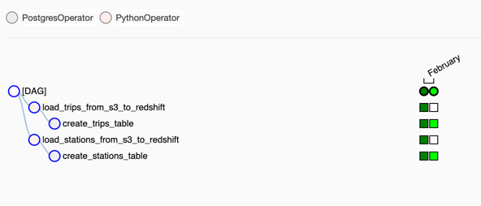
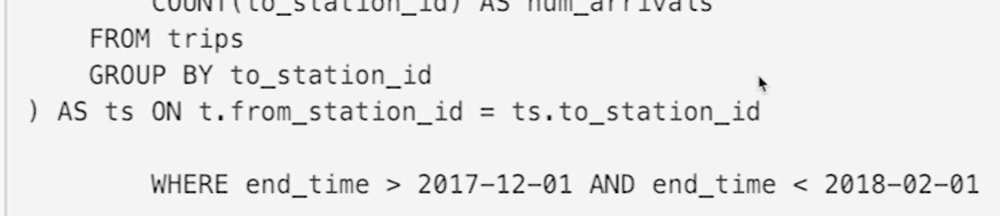
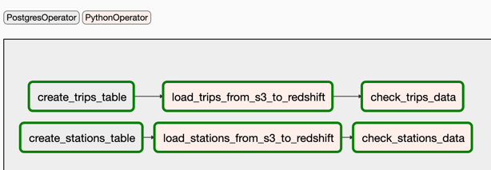
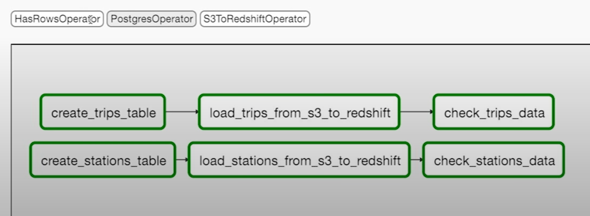
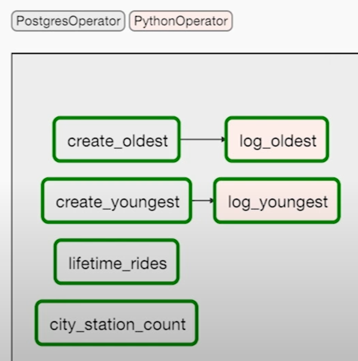
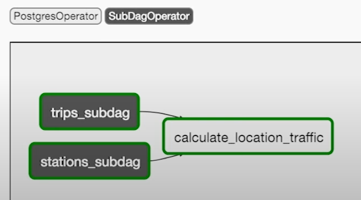
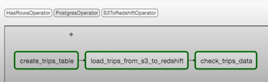

#  Automate Data Pipelines Exercises
This exercises section contains the exercises given under the related course title.

## 2. Data Pipelines Exercises

### Exercise 1 - Airflow DAGs
* [The exercise](airflow/dags/lesson1_exercises/exercise1.py)
* [The solution](airflow/dags/lesson1_solutions/solution1.py)

### Exercise 2 - Run the Schedules
* [The exercise](airflow/dags/lesson1_exercises/exercise2.py)
* [The solution](airflow/dags/lesson1_solutions/solution2.py)
* Setting `start_date` on the past

### Exercise 3 - Task Dependencies
* [The exercise](airflow/dags/lesson1_exercises/exercise3.py)
* [The solution](airflow/dags/lesson1_solutions/solution3.py)

```text
                 -> addition
               /                \
   hello_world                   -> division
               \                /
                 -> subtraction
```

<div style="text-align: center"></div>

### Exercise 4 - Connections and Hooks
* [The exercise](airflow/dags/lesson1_exercises/exercise4.py)
* [The solution](airflow/dags/lesson1_solutions/solution4.py)
* Create an IAM user `awsuser` with `Programmatic access` and with the following policies:
  * AdministratorAccess
  * AmazonRedshiftFullAccess
  * AmazonS3FullAccess
* Adding new variables under Airflow UI / Admin / Variables, "s3_bucket" & "s3_prefix",
* Adding "Amazon Web Services" connection under Airflow UI / Admin / Connections
  * Set a "Conn Id", "Conn Type" (as `Amazon Web Services`), "Login" (as `awsuser.<Access key ID>`) and "Password" (as `awsuser.<Secret access key>`)
* The task lists S3 objects

### Exercise 5 - Context & Templating
* [The exercise](airflow/dags/lesson1_exercises/exercise5.py)
* [The solution](airflow/dags/lesson1_solutions/solution5.py)
* Setting `provide_context=True`
* Printing all the [Airflow context values](https://airflow.apache.org/docs/apache-airflow/stable/macros-ref.html):

```python
def python_callable(*args, **kwargs):
    pprint.pprint(kwargs)

task = PythonOperator(
    ...
    python_callable=python_callable,
    provide_context=True,
)
```

* The DAG is activated at 2022-09-14 13:55:51 UTC, and the output is:

```json
{
 'END_DATE': '2022-09-13',
 'conf': <module 'airflow.configuration' from '/opt/conda/lib/python3.6/site-packages/airflow/configuration.py'>,
 'dag': <DAG: lesson1.solution5>,
 'dag_run': <DagRun lesson1.solution5 @ 2022-09-13 00:00:00+00:00: scheduled__2022-09-13T00:00:00+00:00, externally triggered: False>,
 'ds': '2022-09-13',
 'ds_nodash': '20220913',
 'end_date': '2022-09-13',
 'execution_date': <Pendulum [2022-09-13T00:00:00+00:00]>,
 'inlets': [],
 'latest_date': '2022-09-13',
 'macros': <module 'airflow.macros' from '/opt/conda/lib/python3.6/site-packages/airflow/macros/__init__.py'>,
 'next_ds': '2022-09-14',
 'next_ds_nodash': '20220914',
 'next_execution_date': datetime.datetime(2022, 9, 14, 0, 0, tzinfo=<TimezoneInfo [UTC, GMT, +00:00:00, STD]>),
 'outlets': [],
 'params': {},
 'prev_ds': '2022-09-12',
 'prev_ds_nodash': '20220912',
 'prev_execution_date': datetime.datetime(2022, 9, 12, 0, 0, tzinfo=<TimezoneInfo [UTC, GMT, +00:00:00, STD]>),
 'run_id': 'scheduled__2022-09-13T00:00:00+00:00',
 'tables': None,
 'task': <Task(PythonOperator): print_context>,
 'task_instance': <TaskInstance: lesson1.solution5.print_context 2022-09-13T00:00:00+00:00 [running]>,
 'task_instance_key_str': 'lesson1.solution5__print_context__20220913',
 'templates_dict': None,
 'test_mode': False,
 'ti': <TaskInstance: lesson1.solution5.print_context 2022-09-13T00:00:00+00:00 [running]>,
 'tomorrow_ds': '2022-09-14',
 'tomorrow_ds_nodash': '20220914',
 'ts': '2022-09-13T00:00:00+00:00',
 'ts_nodash': '20220913T000000',
 'ts_nodash_with_tz': '20220913T000000+0000',
 'var': {'json': None, 'value': None},
 'yesterday_ds': '2022-09-12',
 'yesterday_ds_nodash': '20220912'
}
```

### Exercise 6 - Build the S3 to Redshift DAG
* [The exercise](airflow/dags/lesson1_exercises/exercise6.py)
* [The solution](airflow/dags/lesson1_solutions/solution6.py)
* Add `Amazon Web Services` connection on Airflow UI like defined on Exercise 4.
* Create a redshift cluster and add a connection via Airflow UI:

<div style="text-align: center"><br>Redshift Connection</div>

<br>
<div style="text-align: center"><br>Executed Tasks</div>

## 3. Data Quality Exercises

### Exercise 1 - Data Lineage in Airflow
* [The exercise](airflow/dags/lesson2_exercises/exercise1.py)
* [The solution](airflow/dags/lesson2_solutions/solution1.py)
* The purpose of this exercise showing the effect of change on task dependencies on the same DAG.
* After change, Airflow shows only the last deployed DAG's task dependencies.

### Exercise 2 - Schedules and Backfills in Airflow
* [The exercise](airflow/dags/lesson2_exercises/exercise2.py)
* [The solution](airflow/dags/lesson2_solutions/solution2.py)
* Setting `max_active_runs=1` & `end_date`
* With `max_active_runs=1` setting, we make sure that after all tasks are executed under a DAG, next DAG can start.
```python
dag = DAG(
    'lesson2.exercise2',
    start_date=datetime.datetime(2018, 1, 1, 0, 0, 0, 0),
    end_date=datetime.datetime(2018, 2, 1, 0, 0, 0, 0),
    schedule_interval='@monthly',
    max_active_runs=1
)
```

<div style="text-align: center"><br>max_active_runs=1 for DAG</div>

### Exercise 3 - Data Partitioning
* [The exercise](airflow/dags/lesson2_exercises/exercise3.py)
* [The solution](airflow/dags/lesson2_solutions/solution3.py)
* Using time partitioning (by using `execution_date` in PythonOperator).
* It helps us to parallelize the execution of the DAG
```python
def load_trip_data_to_redshift(*args, **kwargs):
    aws_hook = AwsHook("aws_credentials")
    credentials = aws_hook.get_credentials()
    redshift_hook = PostgresHook("redshift")
    execution_date = kwargs["execution_date"]  # <---- Getting task execution date
    sql_stmt = sql_statements.COPY_MONTHLY_TRIPS_SQL.format(
        credentials.access_key,
        credentials.secret_key,
        year=execution_date.year, #     <---- Using task execution date on WHERE clause
        month=execution_date.month #    <---- Using task execution date on WHERE clause
    )
    redshift_hook.run(sql_stmt)

PythonOperator(
    task_id='...',
    dag=...,
    python_callable=load_trip_data_to_redshift,
    provide_context=True, #             <---- Required to get Airflow context variables
)
```
* Another way of implementing time partitioning with PostgresOperator (by using [context variables](https://airflow.apache.org/docs/apache-airflow/stable/macros-ref.html)):
```python
PostgresOperator(
    task_id="...",
    dag=...,
    postgres_conn_id="...",
    sql=f"""
        {sql_statements.LOCATION_TRAFFIC_SQL}
        WHERE end_time > {{{{ prev_ds }}}} AND end_time < {{{{ next_ds }}}}
    """
)
```
<div style="text-align: center"><br>PostgresOperator Logs</div>

### Exercise 4 - Data Quality Checks
* [The exercise](airflow/dags/lesson2_exercises/exercise4.py)
* [The solution](airflow/dags/lesson2_solutions/solution4.py)
* Adding data quality tasks (`check_stations` & `check_trips`) at the end of the process
* Adding `sla` restriction for time-consuming tasks ([Airflow SLAs](https://airflow.apache.org/docs/apache-airflow/1.10.10/concepts.html?highlight=slas#slas))
* Using `params` in `PythonOperator`

```python
def check_greater_than_zero(*args, **kwargs):
    table = kwargs["params"]["table"]
    redshift_hook = PostgresHook("redshift")
    records = redshift_hook.get_records(f"SELECT COUNT(*) FROM {table}")
    if len(records) < 1 or len(records[0]) < 1:
        raise ValueError(f"Data quality check failed. {table} returned no results") #   <-------- data quality violation

    num_records = records[0][0]
    if num_records < 1:
        raise ValueError(f"Data quality check failed. {table} contained 0 rows") #      <-------- data quality violation

    logging.info(f"Data quality on table {table} check passed with {records[0][0]} records")

...

copy_stations_task = PythonOperator(
    task_id='load_stations_from_s3_to_redshift',
    ...
    sla=datetime.timedelta(hours=1) #   <------------------------------ sla restriction
)

check_stations = PythonOperator(
    task_id='check_stations_data',
    dag=dag,
    python_callable=check_greater_than_zero,
    provide_context=True,
    params={
        'table': 'stations', #          <------------------------------ setting additional parameters
    }
)

...
copy_stations_task >> check_stations
```
<div style="text-align: center"><br>Data Quality Checks Example</div>

## 4. Production Data Pipelines Exercises

### Exercise 1 - Operator Plugins
* [The exercise](airflow/dags/lesson3/exercise1.py)
* [The solution](airflow/dags/lesson3/solution1.py)
* Implementing & Using custom operators (HasRowsOperator)

<div style="text-align: center"><br>Custom HasRowsOperator</div>

### Exercise 2 - Refactor a DAG
* [The exercise](airflow/dags/lesson3/exercise2.py)
* Refactoring a DAG with a single overloaded task into a DAG with several tasks with well-defined boundaries.
* The solution should be:

<div style="text-align: center"><br>Exercise 2 - refactoring solution</div>

### Exercise 3 - Demo SubDAGs
* [The exercise & The solution](airflow/dags/lesson3/exercise3)
* #1 - Consolidate HasRowsOperator into the SubDag
* #2 - Reorder the tasks to take advantage of the SubDag Operators

<div style="text-align: center"><br>Exercise 3 - DAGs Graph View</div>
<br>
<div style="text-align: center"><br>Exercise 3 - trips_subdag Graph View</div>

### Exercise 4 - Building a Full Pipeline
* [The exercise & The solution](airflow/dags/lesson3/exercise4.py)
* [FactsCalculatorOperator](airflow/plugins/operators/facts_calculator.py)
* In this exercise you will construct a DAG and custom operator end-to-end on your own. Our bikeshare company would like to create a trips facts table every time we update the trips data. You've decided to make the facts table creation a custom operator so that it can be reused for other tables in the future.
