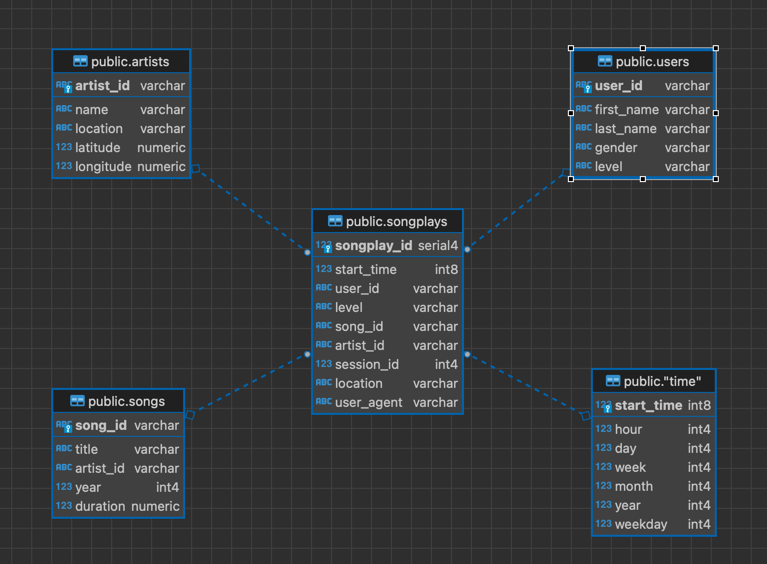

# Sparkify Data Modeling with Postgres

## Summary
In the scope of this project we would like analyze data collected from streaming app. 
The main focus is understanding songs and users data relations to provide feedback to Analytics Team.
Since the data are collected into 2 different json datasets it is hard to extract the relation and make query on it.
We will create Postgres Analytic database and create a pipeline to feed this database. 

At the end, Analytics Team can analyze the songs and the user relations easily like making the following queries:
* Which songs are mostly listened by paid customers?
* How often do customers listen to music on days of the week? 
* Which songs are mostly preferred by women's or man's? 
* Which songs are mostly listened on the weekends?

## Data
We have the following Datasets

### 1) Song Dataset
Song Dataset is collected from the [Million Song Dataset](http://millionsongdataset.com/) with the following format:

```json
{
  "num_songs": 1,
  "artist_id": "ARD7TVE1...",
  "artist_latitude": null,
  "artist_longitude": null,
  "artist_location": "California - LA",
  "artist_name": "Casual",
  "song_id": "SOMZWCG...",
  "title": "I Didn't Mean To",
  "duration": 218.93179,
  "year": 0
}
```

Files are located under [./data/song_data/\*/\*/\*/\[SONG_FILENAME\].json](./data/song_data)

Folder structure is the first three letters of each song's track IDs like:
```text
song_data/A/B/C/TRABCEI128F424C983.json
song_data/A/A/B/TRAABJL12903CDCF1A.json
```

We have 74 json files under `song_data` folder


### 2) Log Dataset

We have used November 2018 log data. Its format is:

```json
{
  "artist": "Great Lake Swimmers",
  "auth": "Logged In",
  "firstName": "...",
  "gender": "M",
  "itemInSession": 0,
  "lastName": "...",
  "length": 215.11791,
  "level": "free",
  "location": "Harrisburg-Carlisle, PA",
  "method": "PUT",
  "page": "NextSong",
  "registration": 1540006905796.0,
  "sessionId": 815,
  "song": "Your Rocky Spine",
  "status": 200,
  "ts": 1542931645796,
  "userAgent": "\"Mozilla\/5.0 (Macintosh; Intel Mac OS X 10_9_4) AppleWebKit\/537.36 (KHTML, like Gecko) Chrome\/36.0.1985.125 Safari\/537.36\"",
  "userId": "66"
}
```

The log data are collected for each day as a separate json file.

Files are located under [./data/log_data/\[YEAR\]/\[MONTH\]/\[LOG_FILENAME\].json](./data/song_data) like:
```text
log_data/2018/11/2018-11-12-events.json
log_data/2018/11/2018-11-13-events.json
```

## Project structure

```text
|-- data
|   |-- log_data
|   |   `-- 2018
|   |       `-- 11
|   |           |-- 2018-11-01-events.json
|   |           |-- ...
|   |           `-- 2018-11-30-events.json
|   `-- song_data
|       `-- A
|           |-- A
|           |   |-- A
|           |   |   |-- TRAAAAW128F429D538.json
|           |   |   `-- ...
|           |   |-- B
|           |   |   |-- TRAABCL128F4286650.json
|           |   |   `-- ...
|           `...
|-- etl.ipynb
|-- create_tables.py
|-- etl.py
|-- sql_queries.py
|-- test.ipynb
`-- README.md
```

* `etl.ipynb`: This Jupyter Notebook file describes the steps one by one while building our Sparkify Data Warehouse and pipeline.
* `create_tables.py`: It contains the python code to establish the database and reset it.
* `etl.py`: It is our pipeline code to fill the Database by using the data described above (e.g.: `log_data` & `song_data`)
* `sql_queries.py`: It contains the sql queries and templates, to create & insert into & query from the tables.
* `test.ipynb`: It is another Notebook file, it contains the tests of the tables by querying its contents.

## Entity Relationship Diagram (ERD)

We have used star schema in this project to build our Analytical Data Warehouse.

With star schema design you need to define a single fact table and multiple dimension tables.

All relations between fact and dimension tables are Many to one (or zero, if data is not defined in dimension table).



The screenshot taken from DBeaver ERD diagram tool.

## RUN 

### Setting development env.

It requires Python 3.8 or higher.
```shell
$ python3 -m venv venv
$ source venv/bin/activate
$ pip install --upgrade pip
$ pip install -r requirements.txt
```

### Creating the Sparkify Data Warehouse 

1) You need to set the following configs for PostgreSQL Database Connection in [./create_tables.py](./create_tables.py):

```python
DEFAULT_DB_NAME = "..."
DEFAULT_DB_USER = "..."
DEFAULT_DB_PASSWORD = "..."
```

And then you need to run this code only once, it will connect the DB and creates the tables:

`$ python create_tables.py`


2) Run the pipeline code to fill the database:

`$ python etl.py`

3) Then you can run test.ipynb to check the results.


# Sample Analytical Queries

## Which songs are mostly listened by paid customers?
```sql
select s.title, COUNT(*) as count from songplays sp 
  left join songs s ON sp.song_id = s.song_id 
  left join users u on sp.user_id = u.user_id 
  where u."level" = 'paid'
  group by s.title
  order by count desc;
```

Results:
```text
title         |count|
--------------+-----+
              | 4274|
Setanta matins|    1|
```

Since the database is only filled with the 74 songs file taken from [Million Song Dataset](http://millionsongdataset.com/) 
the results are not good enough.

## How often do customers listen to music on days of the week? 

```sql
select t.weekday, COUNT(*) as count from songplays sp 
  left join "time" t on t.start_time = sp.start_time 
  group by t.weekday
  order by t.weekday;
```

Results:
```text
weekday|count|
-------+-----+
      0| 1014|
      1| 1071|
      2| 1364|
      3| 1052|
      4| 1295|
      5|  628|
      6|  396|
```

Monday=0,
...
Saturday=5,
Sunday=6
