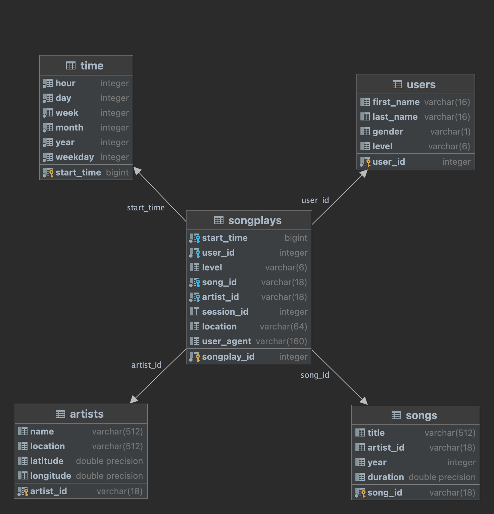

# Data Warehouse

## Table of Contents

<!-- TOC -->
* [1. Introduction](#1-introduction)
* [2. Datasets](#2-datasets)
  * [2.1. Song Dataset](#21-song-dataset)
  * [2.2. Log Dataset](#22-log-dataset)
  * [2.3. Analysing the Data & Column Types](#23-analysing-the-data--column-types)
* [3. Project Development Steps](#3-project-development-steps)
  * [3.1. Redshift Cluster Setup with Terraform](#31-redshift-cluster-setup-with-terraform)
  * [3.2. Create Table Schemas](#32-create-table-schemas)
    * [3.2.1. Create the Staging Tables](#321-create-the-staging-tables)
    * [3.2.2. Create DWH Analytical Tables](#322-create-dwh-analytical-tables)
  * [3.3. Build ETL Pipeline](#33-build-etl-pipeline)
  * [3.4. Define Sample Analytical Queries](#34-define-sample-analytical-queries)
  * [3.5. Final Cleanup](#35-final-cleanup)
* [4. Run The Project](#4-run-the-project)
* [5. Folder Structure](#5-folder-structure)
<!-- TOC -->

## 1. Introduction

A music streaming startup, Sparkify, has grown their user base and song database and want to move their processes and data onto the cloud.
Their data resides in S3, in a directory of JSON logs on user activity on the app, as well as a directory with JSON metadata on the songs in their app.

In the scope of this project an ETL pipeline was build. This pipeline:
* extracts the data from S3,
* stages them in a Redshift Cluster,
* transforms the data into a set of dimensional tables

Thus, the analytics team can continue finding insights into what songs their users are listening to.
You'll be able to test your database and ETL pipeline by running queries given to you by the analytics team from Sparkify and compare your results with their expected results.

## 2. Datasets
We have the following Datasets:

* Song Dataset
* Log Dataset

### 2.1. Song Dataset
It is a subset of real data from the [Million Song Dataset](http://millionsongdataset.com/).
Each file is in JSON format and contains metadata about a song and the artist of that song.
The files are partitioned by the first three letters of each song's track ID. For example, here are file paths to two files in this dataset.

```text
song_data/A/B/C/TRABCEI128F424C983.json
song_data/A/A/B/TRAABJL12903CDCF1A.json
...
```
And below is an example of what a single song file, looks like:

```json
{
  "num_songs": 1,
  "artist_id": "ARJIE2Y1187B994AB7",
  "artist_latitude": null,
  "artist_longitude": null,
  "artist_location": "",
  "artist_name": "Line Renaud",
  "song_id": "SOUPIRU12A6D4FA1E1",
  "title": "Der Kleine Dompfaff",
  "duration": 152.92036,
  "year": 0
}
```

### 2.2. Log Dataset
The second dataset consists of log files in JSON format generated by this [event simulator](https://github.com/Interana/eventsim) based on the songs in the dataset above.
These simulate app activity logs from an imaginary music streaming app based on configuration settings.

The log files in the dataset are partitioned by year and month. For example, here are file paths to two files in this dataset:

```text
log_data/2018/11/2018-11-12-events.json
log_data/2018/11/2018-11-13-events.json
```

And below is an example of what a single record in a log file:

```json
{
  "artist": "N.E.R.D. FEATURING MALICE",
  "auth": "Logged In",
  "firstName": "Jayden",
  "gender": "M",
  "itemInSession": 0,
  "lastName": "Fox",
  "length": 288.99220,
  "level": "free",
  "location": "\"New Orleans-Metairie, LA\"",
  "method": "PUT",
  "page": "NextSong",
  "registration": 1541033612796,
  "sessionId": 184,
  "song": "Am I High (Feat. Malice)",
  "status": 200,
  "ts": 1541121934796,
  "userAgent": "\"Mozilla/5.0 (Windows NT 6.3; WOW64) AppleWebK...",
  "userId": 101
}
```

### 2.3. Analysing the Data & Column Types

The data & their types are analysed in more detail in this [Jupyter Notebook](./notebooks/describe_data.ipynb).

You can also check the following resources:

* [Redshift Data Types](https://docs.aws.amazon.com/redshift/latest/dg/c_Supported_data_types.html)
* [NumPy Data Types](https://www.w3schools.com/python/numpy/numpy_data_types.asp)

## 3. Project Development Steps

* 3.1. Redshift Cluster Setup with Terraform
* 3.2. Create Table Schemas
* 3.3. Build ETL Pipeline
* 3.4. Define Sample Analytical Queries
* 3.5. Final Cleanup


### 3.1. Redshift Cluster Setup with Terraform
The cluster setup is documented under [./infrastructure](./infrastructure) folder. Briefly, the following steps were applied:
* Create an Admin User
* Define Terraform AWS Infrastructure Configurations
* Apply the Terraform Changes


### 3.2. Create Table Schemas
* Analyse the input data (Please check [Describe Data Jupyter Notebook](./notebooks/describe_data.ipynb) )
* Create the Staging Tables
* Create the Analytics Tables

#### 3.2.1. Create the Staging Tables

* staging_songs
```sql
    song_id          varchar(18), -- <- max len result is 18
    num_songs        integer,
    title            varchar(300), -- <- max len result is 255
    artist_name      varchar(400), -- <- max len result is 358
    artist_latitude  double precision,
    year             integer,
    duration         double precision,
    artist_id        varchar(18), -- <- max len result is 18
    artist_longitude double precision,
    artist_location  varchar(300) -- <- max len result is 276
```

* staging_events
```sql
    artist          varchar(120), -- <- max len result is 89
    auth            varchar(16),  -- <- max len result is 10
    first_name      varchar(16),  -- <- max len result is 10
    gender          varchar(1),   -- <- max len result is 1
    item_in_session integer,
    last_name       varchar(16),  -- <- max len result is 9
    length          double precision,
    level           varchar(6),   -- <- max len result is 4
    location        varchar(64),  -- <- max len result is 46
    method          varchar(6),   -- <- max len result is 3
    page            varchar(24),  -- <- max len result is 16
    registration    BIGINT,
    session_id      integer,
    song            varchar(180), -- <- max len result is 151
    status          integer,
    ts              BIGINT,
    user_agent      varchar(160), -- <- max len result is 139
    user_id         integer
```

**Optimizing Redshift table sizes**:

We need to use the smallest possible column size in our DWH tables. It is also mentioned in [AWS Redshift Best Practices](https://docs.aws.amazon.com/redshift/latest/dg/c_best-practices-smallest-column-size.html).

As a methodology after inserting the values without defining the size attribute, we can get the max lengths of the varchar fields:

```redshift
SELECT MAX(LEN(artist))     as max_artist,
       MAX(LEN(auth))       as max_auth,
       MAX(LEN(first_name)) as max_first_name,
       MAX(LEN(gender))     as max_gender,
       MAX(LEN(last_name))  as max_last_name,
       MAX(LEN(level))      as max_level,
       MAX(LEN(location))   as max_location,
       MAX(LEN(method))     as max_method,
       MAX(LEN(page))       as max_page,
       MAX(LEN(song))       as max_song,
       MAX(LEN(user_agent)) as max_user_agent
FROM staging_events;
```

Result:

| max_artist | max_auth | max_first_name | max_gender | max_last_name | max_level | max_location | max_method | max_page | max_song |
|------------|----------|---------------|------------|--------------|-----------|--------------|------------|----------|----------|
| 89         | 10       | 10            | 1          | 9            | 4         | 46           | 3          | 16       | 151      |

Varchar field sizes are set ~%10 higher of these values.


#### 3.2.2. Create DWH Analytical Tables

* Fact Table
  * songplays - records in event data associated with song plays i.e. records with page NextSong (columns: songplay_id, start_time, user_id, level, song_id, artist_id, session_id, location, user_agent)


* Dimension Tables
  * users - users in the app (columns: user_id, first_name, last_name, gender, level)
  * songs - songs in music database (columns: song_id, title, artist_id, year, duration)
  * artists - artists in music database (columns: artist_id, name, location, lattitude, longitude)
  * time - timestamps of records in songplays broken down into specific units (columns: start_time, hour, day, week, month, year, weekday)




**Choosing the best distribution and sort keys:**

These are the suggestions given from [AWS Redshift best practices](https://docs.aws.amazon.com/redshift/latest/dg/c_best-practices-best-dist-key.html):

1. Distribute the fact table and one dimension table on their common columns.

2. Choose the largest dimension based on the size of the filtered dataset.

3. Choose a column with high cardinality in the filtered result set.

4. Change some dimension tables to use ALL distribution.

5. To have Amazon Redshift choose the appropriate distribution style, specify AUTO for the distribution style.

The following decisions are made based on the suggestions and results on [Analyze DWH Tables Jupyter Notebook](./notebooks/analyze_dwh_tables.ipynb):

* In songplays table `song_id` column put `DISTKEY`
* In songplays table `start_time` column put `SORTKEY`
* In songs table `song_id` column put `DISTKEY` & `SORTKEY`
* In users table `user_id` column put `SORTKEY`
* In artists table `artist_id` column put `SORTKEY`
* In time table `start_time` & `year` & `month` & `day` & `weekday` put `SORTKEY`

### 3.3. Build ETL Pipeline

The following steps are implemented,
* Load Data from S3 to Staging Tables
  * Json Path files are used on both `staging_songs` and `staging_events` loadings from S3. Please check `LOG_JSONPATH` & `SONG_JSONPATH` ([and its S3 content here](./s3_resources/songs_json_path.json)) definitions [on dwh.cfg config file](./dwh.cfg)
  * After loading staging tables their contents are analyzed. Please check the results on [Analyze Staging Table Contents - Jupyter Notebook](./notebooks/analyze_staging_data.ipynb)
* Implement unloading `staging_songs` table script to increase loading performance & reduce cluster expense
  * Please check [unload_tables.py](./unload_tables.py)
* Load Data from Staging Tables to Analytics Tables
  * On `songplays` table load, page = `NextSong` records are selected from `staging_events`
  * On `songs` table load, only existing (in `staging_events`) and distinct songs are selected from `staging_songs`
  * On `artists` table load, the same rule applied while loading the `songs` table
  * On `time` table load, only existing (in `songs`) values are loaded from `songs` table. `start_time` column type is set as `timestamp`.
  * On `users` table load, unique users (by `user_id` column) are selected by finding users latest `level` statuses.
  * At the end, DWH Tables content are verified & tested. Please check the results on [Analyze DWH Analytical Tables Results](./notebooks/analyze_dwh_tables.ipynb)

### 3.4. Define Sample Analytical Queries
Please look at the [Sample Analytical Queries - Jupyter Notebook](./notebooks/sample_analytical_queries.ipynb)

### 3.5. Final Cleanup
Remove the Redshift Cluster. Please check the [Remove Redshift Cluster part](./infrastructure/README.md#remove-redshift-cluster)

## 4. Run The Project

Python 3.9.12, pip 22.2.2 is used on the development.

1. Create the Redshift Cluster. Please apply the Terraform steps explained [here](./infrastructure).
2. Install python libraries
```commandline
$ pip install -r requirements.txt
```
3. Create Tables
```commandline
$ python create_tables.py
```
4. Run the ETL Job
```commandline
$ python etl.py
```

## 5. Folder Structure
```text
|-- README.md
|-- dwh.cfg
|-- requirements.txt
|-- create_tables.py
|-- etl.py
|-- sql_queries.py
|-- unload_tables.py
|-- clear_tables.py
|-- infrastructure
|   |-- README.md
|   |-- dev.tfvars
|   |-- variables.tf
|   |-- iam.tf
|   |-- main.tf
|   |-- output.tf
|   |-- redshift.tf
|   |-- securitygroup.tf
|   `-- vpc.tf
|-- s3_resources
|   `-- songs_json_path.json
|-- notebooks
|   |-- describe_data.ipynb
|   |-- analyze_staging_data.ipynb
|   |-- analyze_dwh_tables.ipynb
|   `-- sample_analytical_queries.ipynb
```


